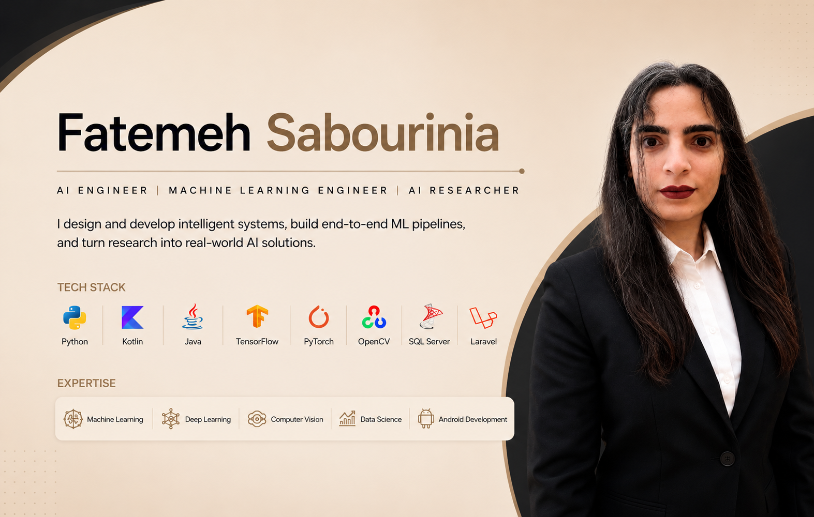

  

# Fatemeh Sabourinia 

### AI Engineer | Machine Learning Engineer | Data Scientist | Android Developer
I specialize in designing and developing intelligent systems using Machine Learning, Deep Learning, Computer Vision, Data Science, and Android technologies.

My experience includes developing deep learning models, building end-to-end machine learning pipelines, deploying AI solutions on Android devices, and conducting research in AI and machine learning. I enjoy transforming research ideas into scalable, practical applications that solve real-world problems.

## Portfolio Website

[View My Portfolio Website](https://fatemehsabourinia.github.io/)

---

## Focus Areas
- Artificial Intelligence
- Machine Learning
- Deep Learning
- Computer Vision
- Data Science
- Mobile AI
- Android Development

  ---
  
## Featured Projects

### [Flower Classification](https://github.com/fatemehsabourinia/Flower-Classification)
An end-to-end AI system for flower species recognition, developed using deep learning and computer vision techniques. The project covers model development and comparative evaluation.

**Models Evaluated**
- XGBoost
- VGG16
- NASNet-Mobile
- MobileNetV2
  
---

### [Dog Breed Recognition](https://github.com/fatemehsabourinia/Dog-Breed-Recognition)
An AI-powered dog breed classification system designed to accurately identify dog breeds from images using deep learning models.

**Models Evaluated**
- Random Forest
- EfficientNetB0
- MobileNetV2 
- NASNet-Mobile

---

## [ADHD Data Science & Machine Learning](https://github.com/fatemehsabourinia/ADHD-Data-Science-ML)
A machine learning framework for ADHD classification using neuroimaging and demographic data. This project evaluates multiple traditional machine learning algorithms to identify the most effective approach for ADHD prediction.

**Models Evaluated**
- CatBoost
- Gradient Boosting
- Logistic Regression
- Random Forest

**Key Techniques**
- Hyperparameter Optimization
- Fairness & Bias Analysis
- Model Evaluation
- Cross Validation

---

## [ADHD Explainable AI](https://github.com/fatemehsabourinia/ADHD-Explainable-AI)
An explainable AI framework for ADHD classification that emphasizes model transparency and interpretability while maintaining predictive performance.

**Models Evaluated**
- XGBoost
- LightGBM
- Random Forest
- Logistic Regression

**Key Techniques**
- Hyperparameter Optimization
- SHAP Explainability
- Model Interpretation
- Cross Validation
- Kernel PCA
    
---

## Android AI Applications
Android applications published on Google Play.

### [FlowerApp](https://github.com/fatemehsabourinia/FlowerApp-Android)
An intelligent flower recognition application that classifies flower species from images using deep learning and computer vision technologies.

[View on Google Play](https://play.google.com/store/apps/details?id=com.zaeri.sabourinia.flowerapp)

---

### [Dog Breed Identifier](https://github.com/fatemehsabourinia/Dog-Breed-Identifier-Android)
An AI-powered application for recognizing dog breeds from images using deep learning and computer vision.

[View on Google Play](https://play.google.com/store/apps/details?id=com.zaeri.sabourinia.dogbreedidentifier)

---

## Research
- Two research papers currently under peer review.
- Research focus: Lightweight and heavyweight deep learning models, transfer learning, and image classification.

---

## Tech Stack

### Programming Languages
- Python
- Kotlin
- PHP
- Java

### AI & Machine Learning
- TensorFlow
- Keras
- TensorFlow Lite
- PyTorch
- Scikit-learn
- OpenCV

### Deep Learning Architectures
- VGG16
- NASNet-Mobile
- MobileNetV2
- EfficientNetB0
  
### Machine Learning Models
- Gradient Boosting
- Logistic Regression
- Random Forest
- CatBoost
- XGBoost
- LightGBM

### Data Science
- Pandas
- NumPy
- Matplotlib
- Plotly

### Backend & Database
- Laravel
- Microsoft SQL Server

### Development Tools
- Git
- GitHub
- Jupyter Notebook
- Android Studio
- Visual Studio Code

---

## Connect with Me

I welcome opportunities for research collaboration, AI and Machine Learning projects, professional networking, and software engineering discussions.

Whether you'd like to discuss AI, explore collaboration opportunities, inquire about my research, or need support for my AI applications, feel free to get in touch.

- **Email:** dogbreedidentifier1995@gmail.com
- **Google Play Developer Account:** [My AI-Powered Applications](https://play.google.com/store/apps/developer?id=Alireza+Zaeri+%26+Fatemeh+Sabourinia)
- **LinkedIn:** [linkedin.com/in/fatemehsabourinia](https://www.linkedin.com/in/fatemehsabourinia/)
- **Portfolio:** [fatemehsabourinia.github.io](https://fatemehsabourinia.github.io/)

---
